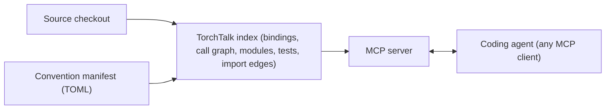

<div align="center">

# TorchTalk

**Give your coding agent structural understanding of the entire codebase.**

Python → C++ → CUDA

*Every codebase speaks more than one language. Now your agent does too.*

[](https://github.com/TorchedHat/torchtalk/actions/workflows/integration-tests.yml)
[](pyproject.toml)
[](LICENSE)
[](https://modelcontextprotocol.io)
[](https://github.com/astral-sh/ruff)

</div>

TorchTalk builds a structural map of a cross-language codebase. Where is
`torch.matmul` actually implemented? Which CUDA kernel does this Python call
dispatch to? Which unit tests break if this C++ function changes? Every answer
comes back with exact file and line evidence, like `LinearAlgebra.cpp:1996`.

It is built for the people who work across the Python and C++ boundary, framework developers,
extension authors, and researchers navigating unfamiliar internals. The index is served over
[MCP](https://modelcontextprotocol.io), so the same answers reach your coding agent
(Claude Code, Cursor, Codex) and your CI pipeline, where impact analysis can drive test
selection.



## Highlights

- **Binding chains.** Trace `torch.matmul` → `at::native::matmul` → `LinearAlgebra.cpp:1996` in one query.
- **Impact analysis.** Ask what breaks if a GEMM kernel changes and get every caller with file and line, plus the affected Python test files.
- **Dispatch mapping.** See which backend (CPU, CUDA, MPS) handles each operation.
- **C++ call graphs.** 60K+ functions with call edges, extracted with libclang.
- **Test discovery.** Find the existing tests for any operator before writing new ones.
- **Cross-framework edges.** Every import from an extension into its base framework becomes an `ExternalRef` edge. Indexing vLLM produces 1,619 of them across 990 modules.
- **Framework agnostic.** Conventions live in TOML manifests, not code. Onboarding a new framework is a small data PR.
- **CI friendly.** Build the index nightly, snapshot it, and restore it in PR jobs in seconds.

## Quick Start

```bash
pip install -e .
```

TorchTalk is a standard MCP server and works with any MCP client. Register it with your agent:

```bash
# Claude Code
claude mcp add torchtalk -s user -- torchtalk mcp-serve --source /path/to/pytorch

# Cursor (copies rules and registers the MCP server in a project)
torchtalk cursor-add -C /path/to/your/project -p /path/to/pytorch

# Any other MCP client points at this command
torchtalk mcp-serve --source /path/to/pytorch
```

On first run TorchTalk builds its index and caches it under `~/.cache/torchtalk/`.
The C++ call graph continues building in the background, so the tools work immediately. You need a
source checkout of the framework you are indexing, and optionally a
`compile_commands.json` from a one-time build for the full C++ call graph.

## Supported Frameworks

Framework conventions are data, not code. Each framework is described by a TOML manifest
(a *harness*) under `src/torchtalk/manifests/`.

| Harness | What it covers | Status |
|---------|----------------|--------|
| `pytorch` | Full pipeline, including `native_functions.yaml`, `derivatives.yaml`, ATen dispatch, and autograd |  |
| `vllm` | Custom ops in `csrc/` (`torch.ops._C`) and the model and quantization registries |  |
| 3rd-party PyTorch extensions | `torchvision` and other extensions, built on the `torch-extension` base harness |  |

Select a harness with `--harness` anywhere a source is indexed or served:

```bash
torchtalk index build --source /path/to/vllm --harness vllm
```

A repo can also ship its own `.torchtalk.toml` at its root, which
`index build` and `index update` activate automatically. Manifests support
`extends` to inherit from `torch-extension`, `depends_on` to name
the harnesses that receive `ExternalRef` edges, and `expected_minimums` for
the counts the smoke test must reach.

**Adding your framework** takes a manifest, an integration-anchor file, and
expected minimums. Each is a small PR with a verify command. Follow
[docs/adding-a-framework.md](docs/adding-a-framework.md)
and open a tracking issue from the
[New framework template](.github/ISSUE_TEMPLATE/new-framework.md).

## MCP Tools

| Tool | Description |
|------|-------------|
| `get_status()` | TorchTalk readiness summary across bindings, call graph, modules, tests |
| `trace(func, focus?)` | Trace any op: Python → YAML → C++ → file:line |
| `search(query, mode?, backend?)` | mode="bindings": dispatch registrations. mode="kernels": CUDA kernel launches |
| `graph(func, mode?, depth?, fuzzy_all_levels?, walk_python?, focus?)` | mode="callers": inbound. mode="calls": outbound. mode="impact": transitive callers |
| `modules(name, mode?, focus?)` | mode="trace": class details (focus="full" adds bases/docstring). mode="list": browse by category ("nn", "optim", "all") |
| `tests(query?, mode?, limit?, focus?)` | mode="find": search tests (focus narrows to functions/classes/files). mode="utils": list utilities. mode="file_info": test file details |
| `affected(funcs, depth?)` | Map changed C++ functions (comma-separated) to impacted Python test files |

## CLI

| Command | Description |
|---------|-------------|
| `init --source <path> [--harness <name>] [--set-default]` | Save a source path (and optionally a default harness) to config |
| `status` | Show config and cache status |
| `mcp-serve [--source <path>] [--harness <name>]` | Start the MCP server |
| `index build [--no-wait] [--harness <name>]` | Build or refresh the index and exit (headless) |
| `index update --since <snapshot>` | Incrementally refresh for files changed since `<snapshot>`'s commit |
| `snapshot save\|load\|list\|delete\|diff\|export\|import` | Capture, restore, compare, and ship index snapshots (see below) |
| `cursor-add -C <project> -p <source>` | Register TorchTalk in a Cursor project |

`--pytorch-source` is kept as an alias for `--source`, so existing configs
and scripts keep working. Snapshot names may use up to three `/`-separated components,
for example `main/abc1234/v1`.

## Snapshots and CI

Snapshots make TorchTalk usable in CI without rebuilding the index per job. Build once on a
nightly runner, ship the `.tar.gz` as a build artifact, and restore it in PR jobs.

<details>
<summary>Snapshot matching (how <code>--nearest</code> resolves)</summary>

Each snapshot records four things.

- **`source_fingerprint`**, a hash of the indexed source path (per checkout).
- **`git_commit`**, the short HEAD at save time.
- **`content_fingerprint`**, a BLAKE2b hash over `HEAD^{tree}` plus the uncommitted diff. It is identical across checkouts of the same code.
- **The harness** it was built with, so a restored snapshot serves with the right conventions.

`snapshot load` accepts a snapshot whose content or path fingerprint matches the
current source. `snapshot load --nearest` resolves in tiered order: exact content match,
then exact commit match, then the most recent ancestor commit (via
`git merge-base --is-ancestor`).

</details>

<details>
<summary>CI recipes (nightly build, PR restore, incremental update)</summary>

**Nightly job: build and publish**

```yaml
- run: torchtalk init --source $GITHUB_WORKSPACE/pytorch
- run: torchtalk index build
- run: torchtalk snapshot save nightly/${{ github.sha }}
- run: torchtalk snapshot export nightly/${{ github.sha }} -o torchtalk-index.tar.gz
- uses: actions/upload-artifact@v4
  with: { name: torchtalk-index, path: torchtalk-index.tar.gz }
```

**PR job: load and use**

```yaml
- uses: actions/download-artifact@v4
  with: { name: torchtalk-index }
- run: torchtalk snapshot import torchtalk-index.tar.gz
- run: torchtalk snapshot load --nearest
- run: torchtalk mcp-serve &
```

**Fast PR refresh with `index update`**

```yaml
- run: torchtalk snapshot load baseline --force
- run: torchtalk index update --since baseline
```

Incremental update re-parses only the C++/CUDA files that
`git diff <baseline-commit>..HEAD` reports as changed, and evicts their
contributions from the C++ call graph before re-attributing. Header changes are resolved via
per-TU include sets captured during the baseline build
(`TranslationUnit.get_includes()`). Every TU whose include closure contains a changed
header is re-parsed. Over-invalidation is possible, never under-invalidation. A changed header not
in any TU's baseline include set is surfaced as a warning with up to 5 sample paths.

**Change-gated workflow.** Use `snapshot diff --json` upstream to
decide what, if anything, to re-run:

```bash
torchtalk snapshot diff nightly/latest current --json \
  | jq '.files_modified | length'
```

</details>

## How It Works

1. **Pick conventions.** Loads the harness manifest from `--harness`, the configured default, or the repo's own `.torchtalk.toml`.
2. **Index.** Detects bindings (pybind11, `TORCH_LIBRARY`), builds the C++ call graph, and indexes Python modules and tests. The `pytorch` harness also parses `native_functions.yaml` and `derivatives.yaml`.
3. **Cache.** Subsequent startups load from `~/.cache/torchtalk/`. The C++ call graph builds in the background, so the tools work immediately.
4. **Serve.** 7 MCP tools answer structural queries with file and line evidence.

<details>
<summary>What gets indexed</summary>

| Data Source | What's Extracted |
|-------------|------------------|
| `native_functions.yaml` | ATen operator definitions with dispatch configs (`pytorch` harness) |
| `derivatives.yaml` | Backward pass formulas for autograd (`pytorch` harness) |
| C++ source | TORCH_LIBRARY bindings, pybind11, CUDA kernels |
| Python source | Modules, classes, method signatures |
| Python imports | `ExternalRef` edges into the harnesses listed in `depends_on` |
| Test files | Test classes, test functions, OpInfo registry |

</details>

<details>
<summary>Project structure</summary>

```
torchtalk/
├── src/torchtalk/
│   ├── server.py              # MCP server (get_status + 6 query tools)
│   ├── indexer.py             # Data loading, caching, initialization
│   ├── cli.py                 # CLI (torchtalk mcp-serve)
│   ├── harness.py             # ConventionManifest: TOML loading, extends, registry
│   ├── manifests/             # Built-in harnesses (pytorch, vllm, torchvision, torch-extension)
│   ├── formatting.py          # Response formatting (CompactText/Markdown)
│   ├── tools/                 # Mode handlers for the MCP tools
│   └── analysis/
│       ├── binding_detector.py    # pybind11/TORCH_LIBRARY detection (tree-sitter)
│       ├── cpp_call_graph.py      # C++ call graph extraction (libclang)
│       ├── python_analyzer.py     # Python module/class analysis (AST)
│       ├── external_refs.py       # Cross-package ExternalRef edges (imports)
│       └── patterns.py            # Search directories, exclusion patterns
├── docs/
│   ├── adding-a-framework.md  # Onboard a new framework (manifest, anchors, minimums)
│   └── bridge-design.md       # ExternalRef / cross-package bridge design
├── .mcp.json                  # MCP server config
└── pyproject.toml             # Package config
```

</details>

## Contributing

The fastest way to contribute is to bring a framework.
[docs/adding-a-framework.md](docs/adding-a-framework.md)
walks through it (manifest, integration anchors, expected minimums), the
[New framework issue template](.github/ISSUE_TEMPLATE/new-framework.md)
tracks progress, and
[tests/integration/_template.yml](tests/integration/_template.yml)
is the integration-anchor starting point. Bug reports and PRs welcome.

## License

[MIT](LICENSE)
